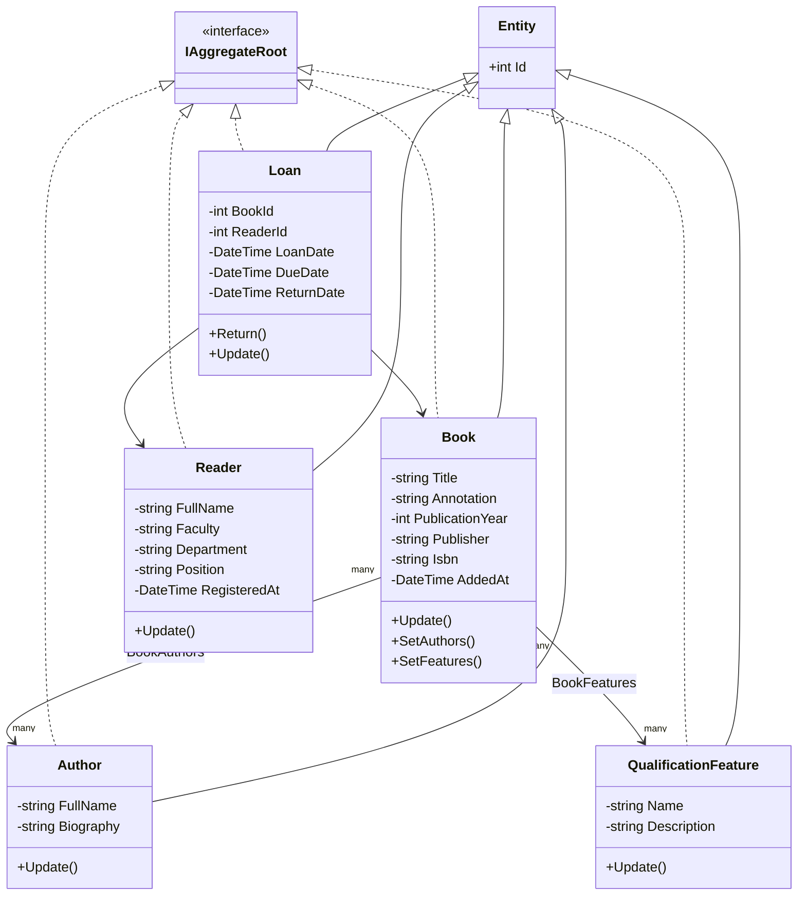

# UML-діаграма предметної області "Кафедральна бібліотека"

```mermaid
classDiagram
    class Entity {
        +int Id
    }
    class IAggregateRoot {
        <<interface>>
    }
    class Author {
        -string FullName
        -string Biography
        +Update()
    }
    class Book {
        -string Title
        -string Annotation
        -int PublicationYear
        -string Publisher
        -string Isbn
        -DateTime AddedAt
        +Update()
        +SetAuthors()
        +SetFeatures()
    }
    class Reader {
        -string FullName
        -string Faculty
        -string Department
        -string Position
        -DateTime RegisteredAt
        +Update()
    }
    class QualificationFeature {
        -string Name
        -string Description
        +Update()
    }
    class Loan{
        -int BookId
        -int ReaderId
        -DateTime LoanDate
        -DateTime DueDate
        -DateTime ReturnDate
        +Return()
        +Update()
    }

    Entity <|-- Author
    Entity <|-- Book
    Entity <|-- Reader
    Entity <|-- QualificationFeature
    Entity <|-- Loan
    IAggregateRoot <|.. Author
    IAggregateRoot <|.. Book
    IAggregateRoot <|.. Reader
    IAggregateRoot <|.. QualificationFeature
    IAggregateRoot <|.. Loan
    Book "many" --> "many" Author : BookAuthors
    Book "many" --> "many" QualificationFeature : BookFeatures
    Loan --> Book
    Loan --> Reader
```